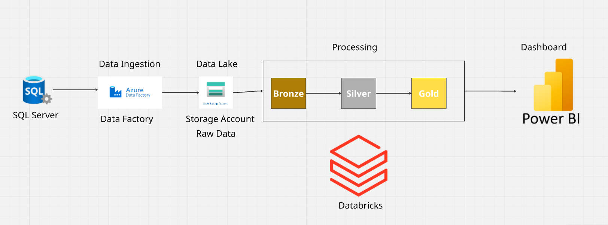

# End-to-End Retail Sales Analytics (Azure + Power BI)

A comprehensive data engineering and analytics project that demonstrates a modern data pipeline using Microsoft Azure services. This project ingests raw database extracts, processes them through a Medallion Architecture, and serves them in a 3-page interactive business intelligence report in Power BI.

## 🛠️ Tools & Technologies

* **Data Ingestion:** Azure Data Factory (ADF)
* **Data Storage:** Azure Data Lake Storage (Gen2)
* **Data Processing:** Azure Databricks (PySpark)
* **Data Visualization:** Microsoft Power BI

## 🏗️ Technical Architecture & Data Pipeline

The pipeline follows a modern Medallion Architecture (Bronze-Silver-Gold) implemented entirely on Microsoft Azure.

### 1. Data Ingestion (Source → Bronze Layer)
Raw data from three source tables (**stores**, **products**, and **transactions**) was ingested using Azure Data Factory (ADF) pipelines. This raw, untouched data was landed in Azure Data Lake Storage (Gen2) as the **Bronze layer**.

### 2. Data Processing (Bronze → Silver → Gold)
The raw data was read into an Azure Databricks cluster for processing using PySpark.

* **Silver Layer:** Data from the three tables was joined, cleaned (handling nulls, correcting types), and business logic was applied to create a clean, unified, and query-ready master table.
* **Gold Layer:** Specific business aggregations (the 8 insights) were pre-calculated from the Silver table to create optimized, smaller "data mart" tables for fast reporting.

### 3. Data Visualization (Loading → Power BI)
Two data loading strategies were used for the Power BI report:

* **Import Mode (Static):** The 8 aggregated Gold tables (e.g., `df_country_revenue`, `df_top_products`) were imported into Power BI for Pages 1 and 2. This ensures extremely fast performance for summary dashboards.
* **DirectQuery/Import Mode (Dynamic):** The master Silver table was loaded into Power BI to power the dynamic Page 3, allowing for real-time, cross-filtering analysis.

## 📈 Power BI Report Overview

The final report consists of three dedicated pages, moving from a high-level summary to a deep analytical tool.

### Page 1: Executive Summary (Financial & Geographical)
A static "bird's-eye view" for executives. It answers: "How are we performing overall?"

* **KPIs:** Total Revenue, Total Customers, and Store Count.
* **Visuals:** A geographical map (`Map`) for revenue by country, a bar chart (`Bar Chart`) for top-performing stores, and a donut chart (`Donut Chart`) for customer distribution.

### Page 2: Product & Category Analysis
A static deep-dive into product performance. It answers: "What are we selling, and where?"

* **Key Visual (Matrix):** A drill-down `Matrix` showing the top products sold within each country (Insight 3).
* **Supporting Visuals:** Bar charts (`Bar Chart`) showing revenue by category (Insight 5) and transaction counts by category and country (Insight 2).

### Page 3: The "Cross-Analysis" Dynamic Dashboard
This is the most powerful page. Unlike the first two pages, this report is a fully dynamic analytical tool built on the clean Silver table. It allows users to perform root-cause analysis.

* **Control Slicers:** Two main slicers control the page: "Select Customer" and "Select Product".
* **Interactive Visuals:**
    * A table ("Customer's Basket") that instantly filters to show **all products a selected customer has ever bought**.
    * A table ("Product's Customers") that instantly filters to show **all customers who have ever bought a selected product**.
    * A bar chart ("Related Stores") that updates to show **which stores** are relevant to the selected customer or product.
* **Purpose:** This page answers strategic questions like "What other products do our 'Wireless Mouse' buyers purchase?" or "Which stores does our VIP customer 'Ahmed Khaled' shop at?"

