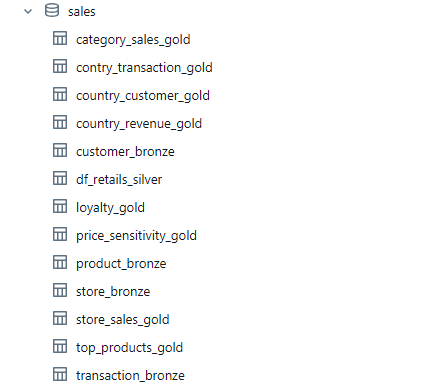

# End-to-End Retail Sales Analytics (Azure + Power BI)

A comprehensive data engineering and analytics project that demonstrates a modern data pipeline using Microsoft Azure services. This project ingests raw database extracts, processes them through a Medallion Architecture, and serves them in a 3-page interactive business intelligence report in Power BI.

## 🛠️ Tools & Technologies

* **Data Ingestion:** Azure Data Factory (ADF)
* **Data Storage:** Azure Data Lake Storage (Gen2)
* **Data Processing:** Azure Databricks (PySpark)
* **Data Visualization:** Microsoft Power BI

## 🏗️ Technical Architecture & Data Pipeline

The pipeline follows a modern Medallion Architecture (Bronze-Silver-Gold) implemented entirely on Microsoft Azure.

### 1. Data Ingestion (Source → Bronze Layer)
Raw data from three source tables (**stores**, **products**, and **transactions**) was ingested using Azure Data Factory (ADF) pipelines. This raw, untouched data was landed in Azure Data Lake Storage (Gen2) as the **Bronze layer**.

### 2. Data Processing (Bronze → Silver → Gold)
The raw data was read into an Azure Databricks cluster for processing using PySpark.

**Silver Layer:** Data from the three tables was joined, cleaned (handling nulls, correcting types), and business logic was applied to create a clean, unified, and query-ready master table.

**Gold Layer:** Specific business aggregations (the 8 insights) were pre-calculated from the Silver table to create optimized, smaller "data mart" tables for fast reporting.

## 🗄️ Data Model Overview (Silver & Gold Layers)

The project leverages a central Silver layer table for detailed analysis (Page 3) and several aggregated Gold layer tables (derived from Silver) for optimized summary reporting (Pages 1 & 2).

| Data Layer   | Table Name (Example)        | Description                                                                                             
| :----------- | :-------------------------- | :------------------------------------------------------------------------------------------------------ 
| **Silver** | `retail_sales_silver.csv`   | Cleaned, joined, and unified master transaction data with all customer, product, and store details.      
| **Gold** | `gold_country_revenue.csv`  | Total sales revenue aggregated by country.                                                              
| **Gold** | `gold_store_sales.csv`      | Total sales revenue aggregated by each store.                                                           
| **Gold** | `gold_country_customer.csv` | Count of unique customers per country.                                                                  
| **Gold** | `gold_category_sales.csv`   | Total sales revenue aggregated by product category.                                                    
| **Gold** | `gold_top_products.csv`     | Top products by total amount, segmented by country.                                                     
| **Gold** | `gold_country_transaction.csv`| Count of transactions per country, segmented by category.                                               
| **Gold** | `gold_customer_loyalty.csv` | Customer names with their respective transaction counts (for loyalty analysis).                           
| **Gold** | `gold_price_sensitivity.csv`| Average price and quantity per product/category for price elasticity analysis.                            

### 3. Data Visualization (Loading → Power BI)
Two data loading strategies were used for the Power BI report:

* **Import Mode (Static):** The 8 aggregated Gold tables (e.g., `df_country_revenue`, `df_top_products`) were imported into Power BI for Pages 1 and 2. This ensures extremely fast performance for summary dashboards.
* **DirectQuery/Import Mode (Dynamic):** The master Silver table was loaded into Power BI to power the dynamic Page 3, allowing for real-time, cross-filtering analysis.

## 📈 Power BI Report Overview

The final report consists of three dedicated pages, moving from a high-level summary to a deep analytical tool.

### Page 1: Executive Summary (Financial & Geographical)
A static "bird's-eye view" for executives. It answers: "How are we performing overall?"

* **KPIs:** Total Revenue, Total Customers, and Store Count.
* **Visuals:** A geographical map (`Map`) for revenue by country, a bar chart (`Bar Chart`) for top-performing stores, and a donut chart (`Donut Chart`) for customer distribution.

### Page 2: Product & Category Analysis
A static deep-dive into product performance. It answers: "What are we selling, and where?"

* **Key Visual (Matrix):** A drill-down `Matrix` showing the top products sold within each country (Insight 3).
* **Supporting Visuals:** Bar charts (`Bar Chart`) showing revenue by category (Insight 5) and transaction counts by category and country (Insight 2).

### Page 3: The "Cross-Analysis" Dynamic Dashboard
This is the most powerful page. Unlike the first two pages, this report is a fully dynamic analytical tool built on the clean Silver table. It allows users to perform root-cause analysis.

* **Control Slicers:** Two main slicers control the page: "Select Customer" and "Select Product".
* **Interactive Visuals:**
    * A table ("Customer's Basket") that instantly filters to show **all products a selected customer has ever bought**.
    * A table ("Product's Customers") that instantly filters to show **all customers who have ever bought a selected product**.
    * A bar chart ("Related Stores") that updates to show **which stores** are relevant to the selected customer or product.
* **Purpose:** This page answers strategic questions like "What other products do our 'Wireless Mouse' buyers purchase?" or "Which stores does our VIP customer 'Ahmed Khaled' shop at?"

## 🏁 Conclusion

This project successfully demonstrates the construction of a complete, end-to-end data analytics pipeline using a modern cloud stack. By leveraging **Azure Data Factory**, **Azure Databricks**, and **Azure Data Lake Storage**, raw transactional data from disparate sources was effectively ingested, processed, and transformed through a robust **Medallion Architecture**.

The final result is a powerful, 3-page interactive **Power BI dashboard** that translates complex data into actionable business insights. The report strategically moves from high-level executive summaries (Pages 1 & 2) to a granular, dynamic, cross-analysis tool (Page 3), empowering stakeholders to move from raw data to strategic decisions effectively.

This solution proves the viability of the Azure data stack for building scalable, manageable, and insightful analytics platforms.

## 👤 Author

**Mazen Sehsah** 
